# Logic-Analyzer
simple and cheap 16 channel logic analyzer based on Cypress CY7C68013A development board

------

## What is the Logic Analyzer

A logic Analyzer can only measure high and low level on a Signal. 

With the recommended software Sigrok more than 110 different protocols like I2C, SPI, CAN.. can be recorded and visually decoded. 

Time resolutions at ~1 MHz (ΔT: 1µs), perfect for hobby application.

------

## Initial setup

### Required hardware: 

- [ ] Cypress CY7C68013A development board [(~5€)](https://www.aliexpress.com/item/976713163.html?spm=a2g0s.9042311.0.0.27424c4dhjcsAo)		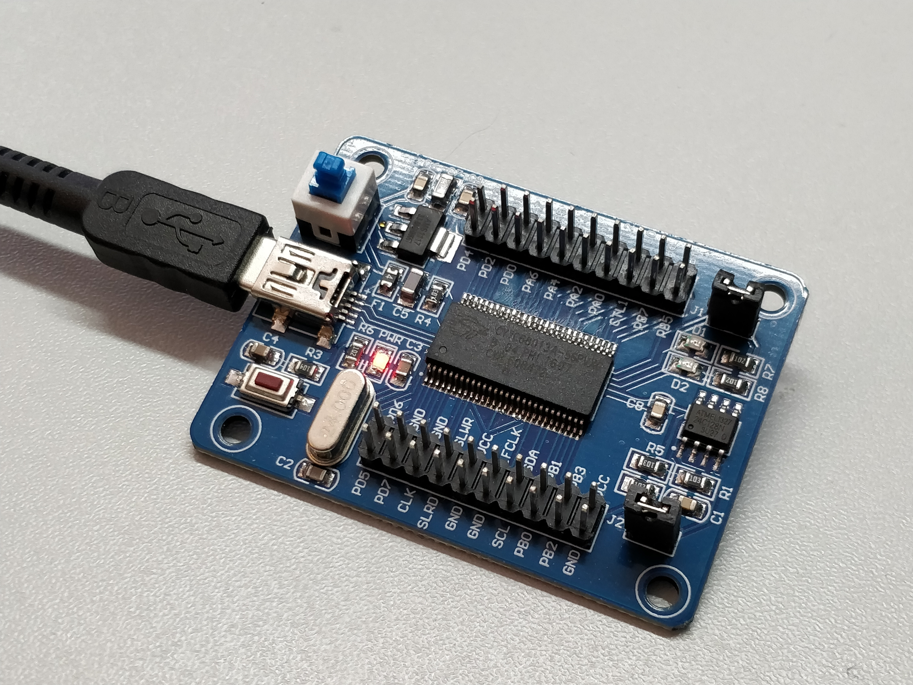

  

- [ ] Logic-Analyzer Shield (optional, but with better pinout then original)				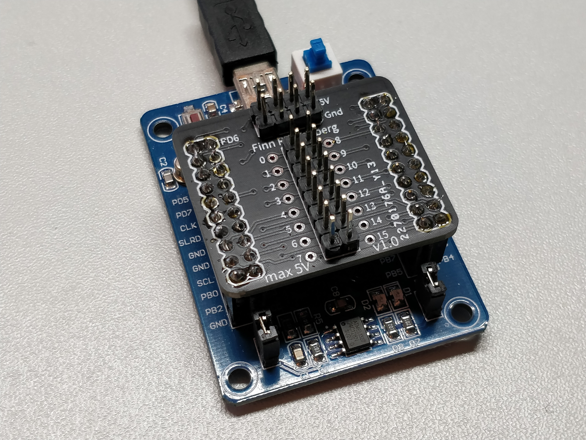

### Required Software:

- [ ] [Sigrok (Application: Pulseview)](https://sigrok.org/wiki/Downloads) used as Open-Source signal analysis software suite
- [ ] Zadig (is included in Pulseview) used for configuring Cypress USB  controller for Windows

### Step 1: Install drivers

- In the application Zadig  -> Options -> List all devices: enable

- Select "Cypress FX2LP"

- Select "WinUSB" driver

- Start installing via "Replace Driver" 

  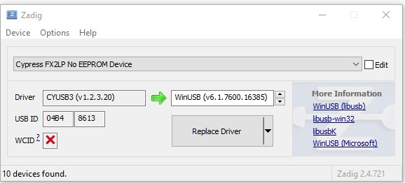

  ​															*before*
  
  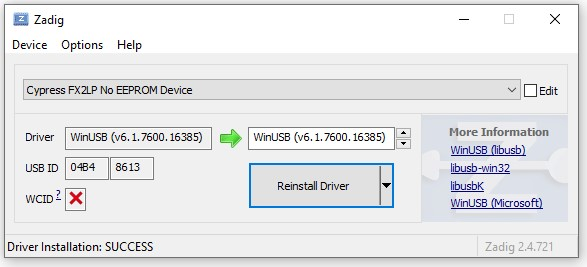
  
  ​															*after*
  
  ### Step 2: Open Pulseview
  
  - Connect the Cypress board and open Pulseview
  - Connect to Device -> choose "fx2lafw" -> USB -> click button "Scan for device" -> select "Cypress FX2"
    - if this fails or no device shows up, jump to Step 3
  - Now everything is setup
  
  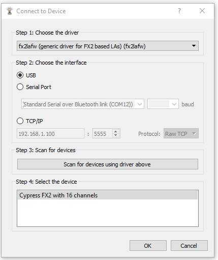
  
  ### Step 3: Install drivers  (again)
  
  - Open Zadig and select the new device "fx2lafw"
  - Also replace their driver with "WinUSB"
  - Retry Step 2 
  
  
  
  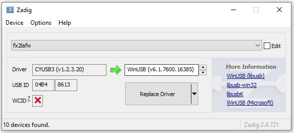
  
  ​															*before*
  
  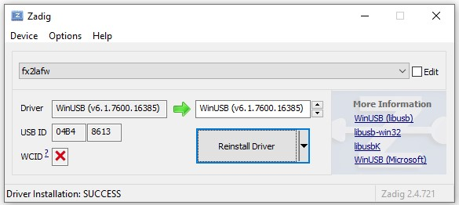
  
  ​															*after*

------

## Example

**Situation:** The Arduino is sending the Serial message (UART) "Hello World" to the computer

**Circuit:** 

- The Arduino and the Logic Analyzer have the same ground potential

- The TX Pin of the Arduino is wired to channel 0 of the Logic Analyzer

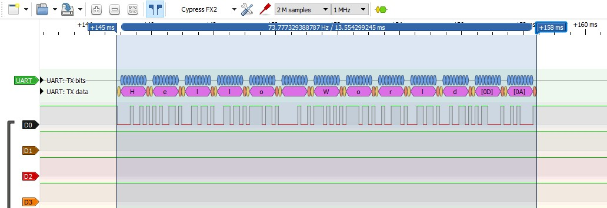

​															The signal D0 is shown and decoded with the included UART Decoder to "Hello World"

## Logic Analyzer Hat

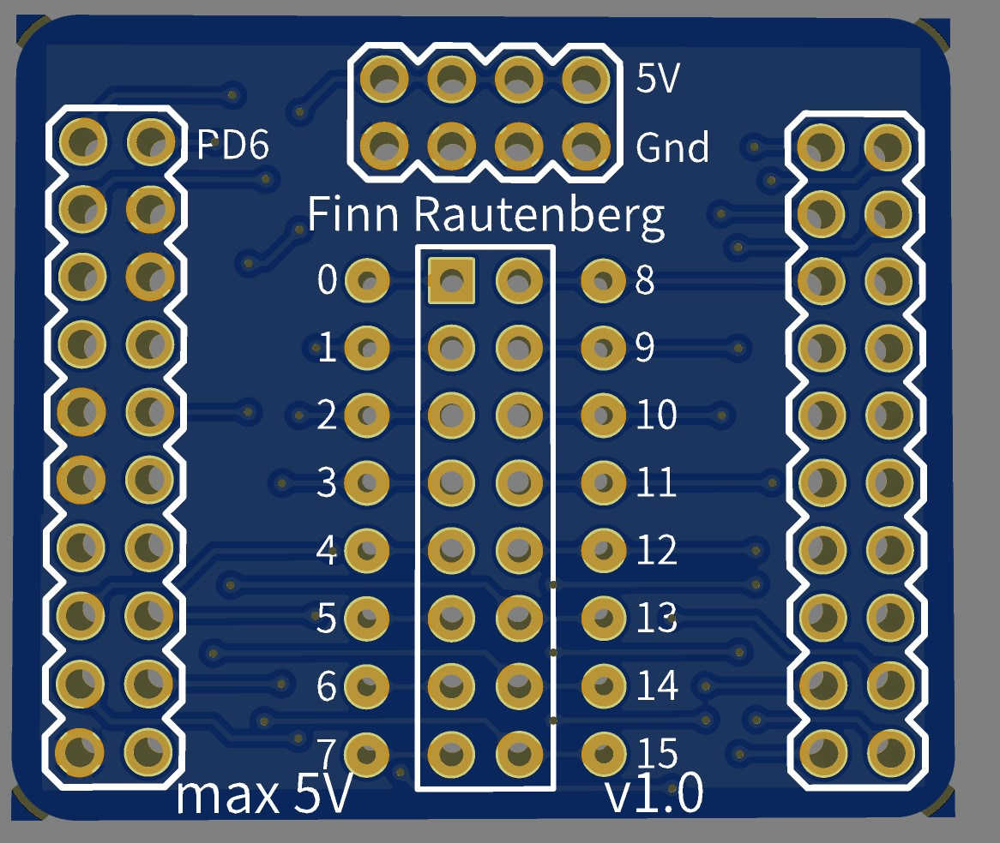

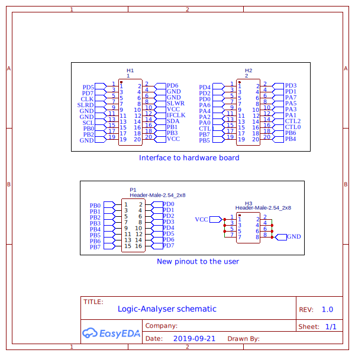

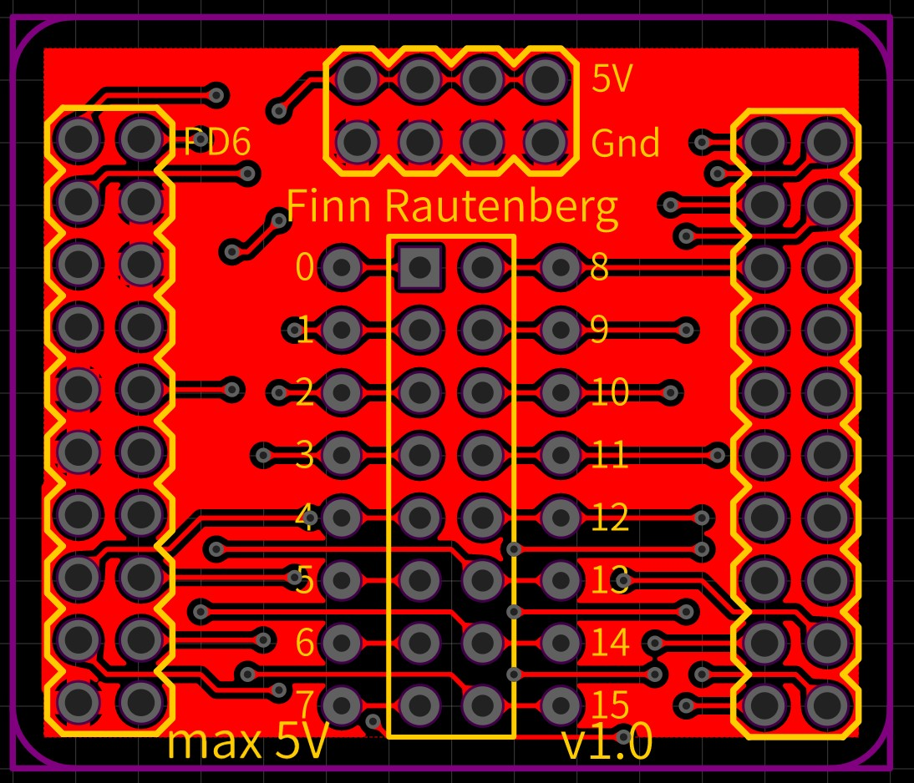

## Troubleshooting

## Pulseview doesn't recognize the Cypress Logic Analyzer

- Redo Steps 1 to 3. Windows sometimes forgets the newly installed drivers

------

## Hardware Maximums

Pulseview offers higher sampling frequency's but the recording time lowers to ~ 300ms. The system is thereby getting unstable

